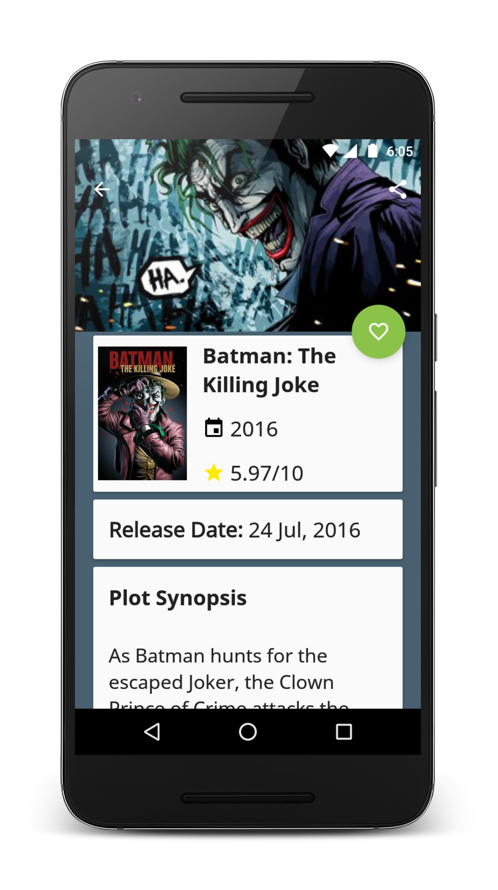
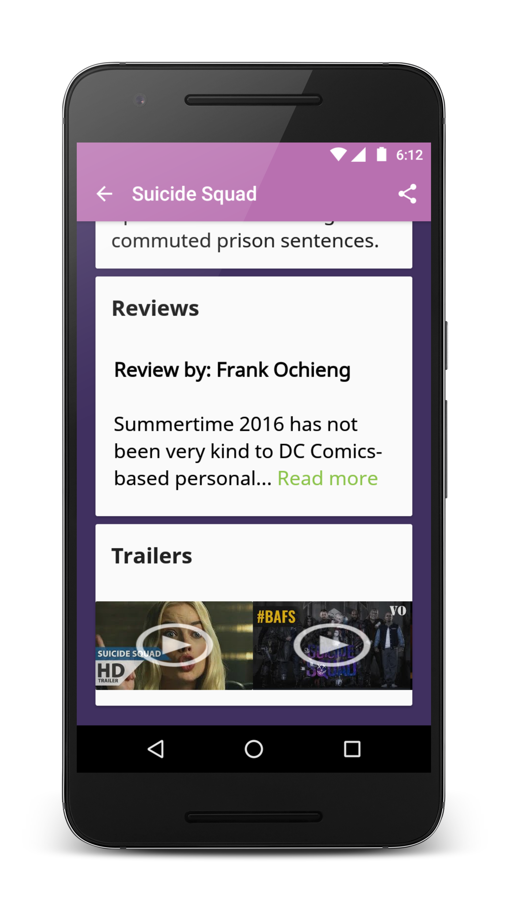

# Popular-Movies
This project is a part of the Android Developer Nanodegree.

* An android app, optimized for tablets, to help users discover popular and highly rated movies on the web.
* It displays a scrolling grid of movie trailers, launches a details screen whenever a particular movie is selected, allows users to save favorites, play trailers, and read user reviews.
* This app utilizes core Android user interface components and fetches movie information using themoviedb.org web API.

## How to use
1. Add your ```TMDB_API_KEY``` in this [file](app/src/main/java/com/example/devipriya/popularmovies/Utilities.java).
2. Build the app using Android Studio or with command line using instructions [here](https://developer.android.com/studio/build/building-cmdline.html).
3. Install the apk file on phone/tablet/emulator.

OR

Download apk from [here](https://github.com/DevipriyaSarkar/Popular-Movies/releases) and install on phone/tablet/emulator.

## Screenshots






## License
The content of this repository is licensed under [MIT LICENSE](LICENSE.MD).
